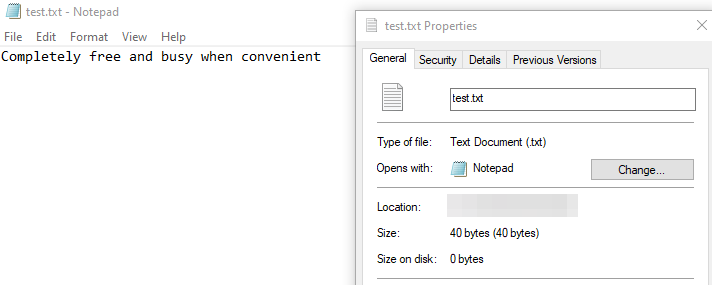

Can you interact with the strange server at `net-track.services.cityinthe.cloud:8090` and see what information you can extract?


Q1 - 25 points
What is the name and version of the software?

- Run an nmap scan on port 8090

```
┌──(kali㉿kali)-[~]
└─$ nmap -p 8090 net-track.services.cityinthe.cloud 

PORT     STATE SERVICE       VERSION
8090/tcp open  opsmessaging?


┌──(kali㉿kali)-[~]
└─$ nmap -sV  -p 8090 net-track.services.cityinthe.cloud 

PORT     STATE SERVICE       VERSION
8090/tcp closed  opsmessaging?
```

- Port is behaving weirdly (showing open and closed)

- Try with netcat

```
┌──(kali㉿kali)-[~]
└─$ nc net-track.services.cityinthe.cloud 8090

Use help to get a list of supported commands
help
Here is a list of commands
version
list
get
help
version
RadicalShell v9

```

- Gives a hung shell prompt
- Type in a command and it will appear

`RadicalShell v9`

Q2 - 25 points
What is the flag?

- Run the `list` command

```
list
records
secret
notes
schedule
contacts

get secret
SKY-NCAT-3071

```

`SKY-NCAT-3071`

Q3 - 50 points
What is the size of the largest file in bytes?

Use `get` to see all the files

```
get secret
SKY-NCAT-3071
get notes
TODO: take flag off server
get schedule
Completely free and busy when convenient
get contacts
Mom : REDACTED, Dad : REDACTED
```

- Since schedule has the most characters, it should be the longest
- Replicate the phrase in a file and look at the size



`40 bytes`